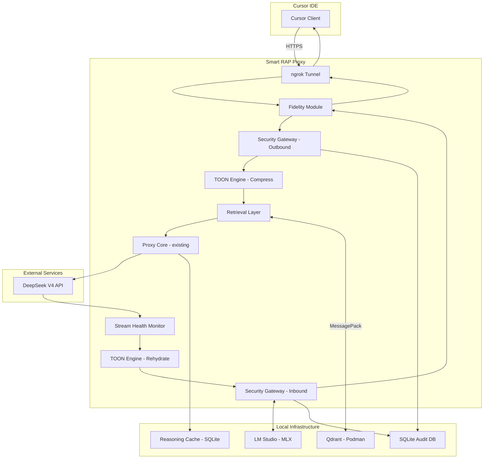
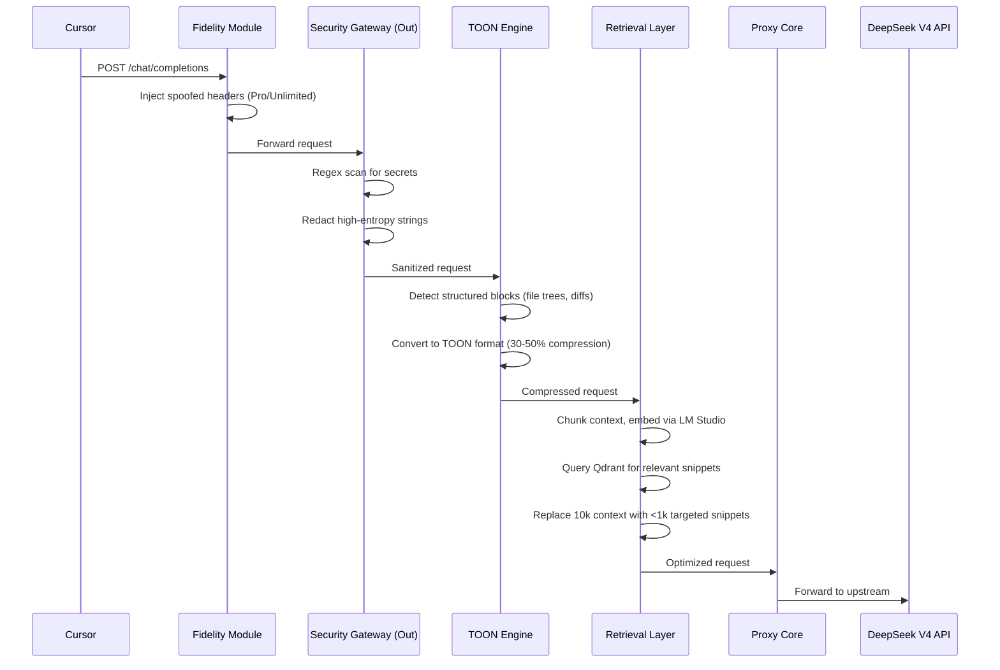
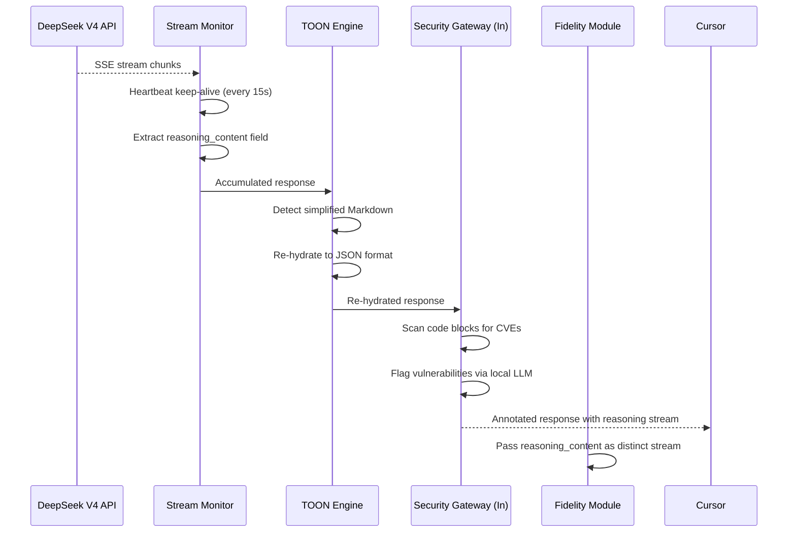
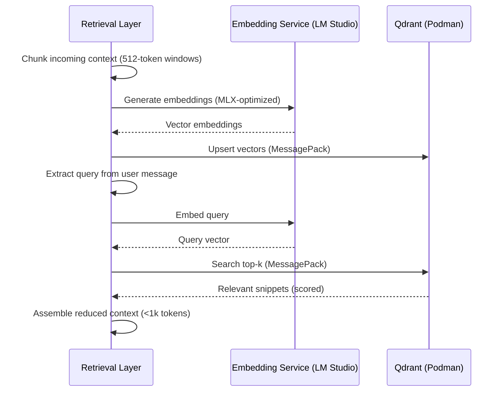

# Design Document: Smart Retrieval-Augmented Proxy (RAP)

## Overview

The Smart Retrieval-Augmented Proxy (RAP) extends the existing DeepSeek Cursor Proxy with five integrated modules that optimize DeepSeek V4 integration within Cursor while maintaining local security and performance. The system adds: (1) an Orchestration Fidelity module for reasoning token pass-through, header spoofing, and stream health monitoring; (2) a Context Optimization engine (TOON) for selective transformation and compression of structured data; (3) a Local Hybrid Intelligence layer using Qdrant vector search and LM Studio for targeted retrieval; (4) a Cybersecurity & Data Integrity gateway for outbound redaction, inbound CVE scanning, and audit logging; and (5) a phased implementation roadmap.

The design preserves the existing proxy's threading model and SQLite-based reasoning cache while introducing new middleware layers that intercept requests and responses at well-defined pipeline stages. Internal communication between the proxy and the Qdrant vector database uses MessagePack for binary-efficient serialization, minimizing overhead on the local loopback interface.

## Architecture



## Sequence Diagrams

### Request Flow (Outbound)



### Response Flow (Inbound)



### Retrieval Flow (Qdrant Interaction)



## Components and Interfaces

### Component 1: Fidelity Module

**Purpose**: Ensures seamless integration between Cursor and DeepSeek V4 by managing reasoning token pass-through, header spoofing, and stream health.

```python
from dataclasses import dataclass
from typing import AsyncIterator, Any


@dataclass(frozen=True)
class FidelityConfig:
    spoof_headers: dict[str, str]
    heartbeat_interval_seconds: float = 15.0
    reasoning_stream_enabled: bool = True
    byok_endpoint: str = "https://api.deepseek.com"


class FidelityModule:
    def __init__(self, config: FidelityConfig) -> None: ...

    def intercept_request(self, headers: dict[str, str], body: dict[str, Any]) -> dict[str, str]:
        """Inject spoofed headers mimicking Pro/Unlimited state."""
        ...

    def extract_reasoning_stream(self, chunk: dict[str, Any]) -> str | None:
        """Extract reasoning_content from SSE chunk as distinct stream."""
        ...

    def heartbeat_wrapper(self, stream: AsyncIterator[bytes]) -> AsyncIterator[bytes]:
        """Wrap upstream stream with keep-alive heartbeats."""
        ...
```

**Responsibilities**:
- Intercept outgoing requests and inject Pro/Unlimited headers
- Route inference to DeepSeek BYOK endpoint
- Extract `reasoning_content` field and emit as separate stream
- Inject heartbeat comments into SSE stream during long reasoning cycles

### Component 2: TOON Engine (Context Optimization)

**Purpose**: Reduces token consumption by converting structured data to a compact notation and re-hydrating model responses back to expected formats.

```python
from dataclasses import dataclass
from typing import Any


@dataclass(frozen=True)
class TOONConfig:
    compression_enabled: bool = True
    rehydration_enabled: bool = True
    min_block_size_bytes: int = 256
    target_compression_ratio: float = 0.5


class TOONEngine:
    def __init__(self, config: TOONConfig) -> None: ...

    def compress(self, messages: list[dict[str, Any]]) -> list[dict[str, Any]]:
        """Identify and compress structured data blocks in messages."""
        ...

    def detect_structured_blocks(self, content: str) -> list[StructuredBlock]:
        """Find file trees, symbol maps, multi-file diffs in content."""
        ...

    def to_toon(self, block: StructuredBlock) -> str:
        """Convert a structured block to TOON format."""
        ...

    def rehydrate(self, content: str) -> str:
        """Convert simplified Markdown back to JSON format Cursor expects."""
        ...

    def compression_ratio(self, original: str, compressed: str) -> float:
        """Calculate achieved compression ratio."""
        ...


@dataclass
class StructuredBlock:
    block_type: str  # "file_tree" | "symbol_map" | "multi_file_diff"
    start_offset: int
    end_offset: int
    raw_content: str
```

**Responsibilities**:
- Detect structured data blocks (file trees, symbol maps, multi-file diffs)
- Convert to Token-Oriented Object Notation (TOON) eliminating redundant JSON keys/brackets
- Re-hydrate model responses from simplified Markdown back to JSON
- Track compression ratios for monitoring

### Component 3: Retrieval Layer (Qdrant + LM Studio)

**Purpose**: Reduces context window usage by chunking, embedding, and retrieving only the most relevant snippets via local vector search.

```python
from dataclasses import dataclass, field
from typing import Any


@dataclass(frozen=True)
class RetrievalConfig:
    qdrant_url: str = "http://localhost:6333"
    embedding_url: str = "http://localhost:1234/v1/embeddings"
    embedding_model: str = "nomic-embed-text"
    chunk_size_tokens: int = 512
    chunk_overlap_tokens: int = 64
    top_k: int = 5
    max_output_tokens: int = 1000
    collection_name: str = "rap_context"
    use_msgpack: bool = True


class RetrievalLayer:
    def __init__(self, config: RetrievalConfig) -> None: ...

    def chunk_context(self, messages: list[dict[str, Any]]) -> list[Chunk]:
        """Split context messages into overlapping chunks."""
        ...

    def embed(self, texts: list[str]) -> list[list[float]]:
        """Generate embeddings via LM Studio endpoint."""
        ...

    def upsert_chunks(self, chunks: list[Chunk]) -> None:
        """Store chunk vectors in Qdrant (MessagePack transport)."""
        ...

    def retrieve(self, query: str, top_k: int | None = None) -> list[ScoredChunk]:
        """Query Qdrant for most relevant snippets."""
        ...

    def build_reduced_context(
        self, query: str, messages: list[dict[str, Any]]
    ) -> list[dict[str, Any]]:
        """Replace full context with targeted retrieval results."""
        ...


@dataclass
class Chunk:
    text: str
    token_count: int
    source_message_index: int
    metadata: dict[str, Any] = field(default_factory=dict)


@dataclass
class ScoredChunk:
    chunk: Chunk
    score: float
    vector_id: str
```

**Responsibilities**:
- Chunk incoming context into 512-token windows with overlap
- Generate embeddings via LM Studio (MLX-optimized models)
- Store/retrieve vectors from Qdrant via Podman container
- Use MessagePack for binary-efficient proxy-to-Qdrant communication
- Reduce pre-fill from ~10,000 tokens to <1,000 tokens

### Component 4: Security Gateway

**Purpose**: Protects sensitive data from leaving the local machine and scans AI-generated code for vulnerabilities.

```python
from dataclasses import dataclass, field
from typing import Any
import re
import sqlite3


@dataclass(frozen=True)
class SecurityConfig:
    redaction_enabled: bool = True
    cve_scanning_enabled: bool = True
    audit_logging_enabled: bool = True
    audit_db_path: str = "~/.deepseek-cursor-proxy/audit.sqlite3"
    local_security_model_url: str = "http://localhost:1234/v1/chat/completions"
    entropy_threshold: float = 4.5
    redaction_patterns: list[str] = field(default_factory=list)


class SecurityGateway:
    def __init__(self, config: SecurityConfig) -> None: ...

    def scan_outbound(self, payload: dict[str, Any]) -> tuple[dict[str, Any], list[Redaction]]:
        """Scan and redact secrets from outbound request."""
        ...

    def scan_inbound(self, response: dict[str, Any]) -> tuple[dict[str, Any], list[CVEFinding]]:
        """Scan AI-generated code blocks for vulnerabilities."""
        ...

    def detect_high_entropy(self, text: str) -> list[tuple[int, int, float]]:
        """Find high-entropy substrings (potential secrets)."""
        ...

    def log_transaction(self, transaction: AuditEntry) -> None:
        """Write audit entry to local SQLite database."""
        ...


@dataclass
class Redaction:
    pattern_name: str
    original_length: int
    position: tuple[int, int]
    replacement: str = "[REDACTED]"


@dataclass
class CVEFinding:
    cve_type: str  # "buffer_overflow" | "hardcoded_credential" | "sql_injection" | ...
    severity: str  # "low" | "medium" | "high" | "critical"
    code_snippet: str
    line_range: tuple[int, int]
    recommendation: str


@dataclass
class AuditEntry:
    timestamp: float
    direction: str  # "outbound" | "inbound"
    request_hash: str
    redactions_count: int
    cve_findings_count: int
    model_used: str
    token_count: int
```

**Responsibilities**:
- Regex-based scanning for API keys, .env variables, SSH keys, high-entropy strings
- Redact sensitive data before prompts reach DeepSeek servers
- Scan AI-generated code blocks for common CVEs (buffer overflows, hardcoded credentials)
- Log all transactions to local SQLite for forensic review

### Component 5: Pipeline Orchestrator

**Purpose**: Coordinates the middleware pipeline, managing the order of operations and error propagation between modules.

```python
from dataclasses import dataclass
from typing import Any


@dataclass(frozen=True)
class PipelineConfig:
    fidelity: FidelityConfig
    toon: TOONConfig
    retrieval: RetrievalConfig
    security: SecurityConfig
    phases_enabled: dict[str, bool]  # phase_name -> enabled


class PipelineOrchestrator:
    def __init__(self, config: PipelineConfig) -> None: ...

    def process_request(self, request: dict[str, Any]) -> dict[str, Any]:
        """Run full outbound pipeline: fidelity -> security -> toon -> retrieval."""
        ...

    def process_response(self, response: dict[str, Any]) -> dict[str, Any]:
        """Run full inbound pipeline: stream -> toon_rehydrate -> security_scan."""
        ...

    def health_check(self) -> dict[str, Any]:
        """Check health of all pipeline components."""
        ...
```

## Data Models

### Configuration Model

```python
from dataclasses import dataclass, field
from pathlib import Path
from typing import Any


@dataclass(frozen=True)
class RAPConfig:
    """Extended proxy configuration for RAP features."""
    # Existing proxy config (inherited)
    host: str = "127.0.0.1"
    port: int = 9000
    upstream_base_url: str = "https://api.deepseek.com"
    upstream_model: str = "deepseek-v4-flash"

    # Fidelity settings
    spoof_pro_headers: bool = True
    heartbeat_interval: float = 15.0
    reasoning_passthrough: bool = True

    # TOON settings
    toon_compression_enabled: bool = True
    toon_rehydration_enabled: bool = True
    toon_min_block_size: int = 256

    # Retrieval settings
    qdrant_url: str = "http://localhost:6333"
    qdrant_collection: str = "rap_context"
    embedding_url: str = "http://localhost:1234/v1/embeddings"
    embedding_model: str = "nomic-embed-text"
    retrieval_top_k: int = 5
    retrieval_max_tokens: int = 1000
    use_msgpack: bool = True

    # Security settings
    redaction_enabled: bool = True
    cve_scanning_enabled: bool = True
    audit_db_path: Path = Path("~/.deepseek-cursor-proxy/audit.sqlite3")
    entropy_threshold: float = 4.5
    security_model_url: str = "http://localhost:1234/v1/chat/completions"

    # Phase control
    phase_bridge: bool = True
    phase_compression: bool = False
    phase_retrieval: bool = False
    phase_security: bool = False
```

**Validation Rules**:
- `heartbeat_interval` must be > 0 and <= 60 seconds
- `qdrant_url` must be a valid HTTP URL
- `embedding_url` must be a valid HTTP URL
- `retrieval_top_k` must be >= 1 and <= 50
- `retrieval_max_tokens` must be >= 100 and <= 10000
- `entropy_threshold` must be >= 3.0 and <= 8.0
- `toon_min_block_size` must be >= 64

### Audit Database Schema

```python
AUDIT_SCHEMA = """
CREATE TABLE IF NOT EXISTS audit_log (
    id INTEGER PRIMARY KEY AUTOINCREMENT,
    timestamp REAL NOT NULL,
    direction TEXT NOT NULL CHECK(direction IN ('outbound', 'inbound')),
    request_hash TEXT NOT NULL,
    model_used TEXT NOT NULL,
    token_count_in INTEGER DEFAULT 0,
    token_count_out INTEGER DEFAULT 0,
    redactions_count INTEGER DEFAULT 0,
    cve_findings_count INTEGER DEFAULT 0,
    compression_ratio REAL DEFAULT NULL,
    retrieval_chunks_used INTEGER DEFAULT 0,
    latency_ms REAL DEFAULT 0,
    status TEXT NOT NULL CHECK(status IN ('success', 'error', 'redacted')),
    metadata TEXT DEFAULT NULL
);

CREATE INDEX IF NOT EXISTS idx_audit_timestamp ON audit_log(timestamp);
CREATE INDEX IF NOT EXISTS idx_audit_direction ON audit_log(direction);
CREATE INDEX IF NOT EXISTS idx_audit_status ON audit_log(status);
"""
```

### TOON Format Specification

```python
@dataclass
class TOONDocument:
    """Token-Oriented Object Notation document."""
    version: str = "1.0"
    blocks: list[TOONBlock] = field(default_factory=list)


@dataclass
class TOONBlock:
    block_type: str
    entries: list[TOONEntry] = field(default_factory=list)


@dataclass
class TOONEntry:
    """Compact entry eliminating redundant JSON structure.

    Example transformation:
    JSON:  {"path": "src/main.py", "type": "file", "size": 1234}
    TOON:  src/main.py|file|1234
    """
    values: list[str]
    separator: str = "|"
```


## Algorithmic Pseudocode

### Main Request Pipeline

```python
def process_request_pipeline(
    raw_request: dict[str, Any],
    config: RAPConfig,
    pipeline: PipelineOrchestrator,
) -> dict[str, Any]:
    """
    ALGORITHM: Full outbound request processing pipeline.

    Preconditions:
        - raw_request contains valid JSON with 'messages' and 'model' keys
        - config is fully validated RAPConfig instance
        - All enabled pipeline components are healthy

    Postconditions:
        - Returns transformed request ready for DeepSeek upstream
        - All secrets redacted if security phase enabled
        - Context compressed if TOON phase enabled
        - Context reduced via retrieval if retrieval phase enabled
        - Audit log entry written if audit enabled

    Loop Invariants:
        - Message list maintains valid OpenAI chat format at each stage
        - No secret material survives past security gateway stage
    """
    request = raw_request.copy()

    # Phase 1: Fidelity - Header injection
    if config.phase_bridge:
        request["_headers"] = inject_spoof_headers(request.get("_headers", {}), config)

    # Phase 2: Security - Outbound redaction
    if config.phase_security and config.redaction_enabled:
        request, redactions = redact_secrets(request, config.entropy_threshold)
        log_audit("outbound", request, redactions_count=len(redactions))

    # Phase 3: TOON - Compression
    if config.phase_compression and config.toon_compression_enabled:
        messages = request.get("messages", [])
        request["messages"] = compress_messages(messages, config.toon_min_block_size)

    # Phase 4: Retrieval - Context reduction
    if config.phase_retrieval:
        messages = request.get("messages", [])
        query = extract_user_query(messages)
        reduced = retrieve_and_reduce(query, messages, config)
        request["messages"] = reduced

    return request
```

### Secret Redaction Algorithm

```python
import math
import re
from typing import Any


# Precompiled patterns for common secret formats
SECRET_PATTERNS: list[tuple[str, re.Pattern[str]]] = [
    ("api_key", re.compile(r"(?:sk|pk|api[_-]?key)[_-][\w]{20,}", re.IGNORECASE)),
    ("aws_key", re.compile(r"AKIA[0-9A-Z]{16}")),
    ("ssh_key", re.compile(r"-----BEGIN (?:RSA |EC |DSA )?PRIVATE KEY-----")),
    ("env_var", re.compile(r"(?:export\s+)?[A-Z_]{2,}=[\'\"]?[\w/+=]{8,}[\'\"]?")),
    ("jwt_token", re.compile(r"eyJ[A-Za-z0-9_-]{10,}\.eyJ[A-Za-z0-9_-]{10,}\.[A-Za-z0-9_-]+")),
    ("github_token", re.compile(r"gh[ps]_[A-Za-z0-9_]{36,}")),
]


def redact_secrets(
    payload: dict[str, Any],
    entropy_threshold: float,
) -> tuple[dict[str, Any], list[Redaction]]:
    """
    Preconditions:
        - payload contains 'messages' list with string 'content' fields
        - entropy_threshold is between 3.0 and 8.0

    Postconditions:
        - All matched patterns replaced with [REDACTED]
        - All high-entropy strings (>= threshold) replaced
        - Original payload not mutated (returns copy)
        - Redaction list contains position and type of each redaction
    """
    redactions: list[Redaction] = []
    result = deep_copy(payload)

    for i, message in enumerate(result.get("messages", [])):
        content = message.get("content", "")
        if not isinstance(content, str):
            continue

        # Pattern-based redaction
        for pattern_name, pattern in SECRET_PATTERNS:
            for match in pattern.finditer(content):
                redactions.append(Redaction(
                    pattern_name=pattern_name,
                    original_length=len(match.group()),
                    position=(match.start(), match.end()),
                ))
                content = content[:match.start()] + "[REDACTED]" + content[match.end():]

        # Entropy-based redaction for unmatched secrets
        for start, end, entropy in detect_high_entropy_spans(content, entropy_threshold):
            if entropy >= entropy_threshold:
                redactions.append(Redaction(
                    pattern_name="high_entropy",
                    original_length=end - start,
                    position=(start, end),
                ))
                content = content[:start] + "[REDACTED]" + content[end:]

        result["messages"][i]["content"] = content

    return result, redactions


def shannon_entropy(text: str) -> float:
    """
    Preconditions:
        - text is non-empty string

    Postconditions:
        - Returns float in range [0, log2(alphabet_size)]
        - Higher values indicate more randomness (likely secrets)
    """
    if not text:
        return 0.0
    freq: dict[str, int] = {}
    for char in text:
        freq[char] = freq.get(char, 0) + 1
    length = len(text)
    return -sum(
        (count / length) * math.log2(count / length)
        for count in freq.values()
    )
```

### TOON Compression Algorithm

```python
import json
from typing import Any


def compress_messages(
    messages: list[dict[str, Any]],
    min_block_size: int,
) -> list[dict[str, Any]]:
    """
    ALGORITHM: Selective TOON compression of structured data blocks.

    Preconditions:
        - messages is a valid list of chat messages
        - min_block_size >= 64 bytes
        - Each message has 'role' and 'content' fields

    Postconditions:
        - Returns messages with structured blocks converted to TOON
        - Non-structured content left unchanged
        - Compression ratio between 0.3 and 0.7 for structured blocks
        - Message count and roles preserved

    Loop Invariants:
        - All processed messages maintain valid chat format
        - Cumulative compression ratio stays within target range
    """
    compressed: list[dict[str, Any]] = []

    for message in messages:
        content = message.get("content", "")
        if not isinstance(content, str) or len(content) < min_block_size:
            compressed.append(message)
            continue

        blocks = detect_structured_blocks(content)
        if not blocks:
            compressed.append(message)
            continue

        # Process blocks in reverse order to preserve offsets
        new_content = content
        for block in sorted(blocks, key=lambda b: b.start_offset, reverse=True):
            toon_repr = to_toon_format(block)
            new_content = (
                new_content[:block.start_offset]
                + toon_repr
                + new_content[block.end_offset:]
            )

        compressed.append({**message, "content": new_content})

    return compressed


def to_toon_format(block: StructuredBlock) -> str:
    """
    Convert structured block to TOON notation.

    Preconditions:
        - block.raw_content is valid JSON or recognized structured format
        - block.block_type is one of: file_tree, symbol_map, multi_file_diff

    Postconditions:
        - Returns string in TOON format
        - Output size <= 70% of input size (30%+ compression)
        - Output is reversible back to original structure via rehydrate()

    Example:
        Input (JSON file tree):
            [{"path": "src/main.py", "type": "file", "size": 1234},
             {"path": "src/utils.py", "type": "file", "size": 567}]

        Output (TOON):
            @TOON:file_tree
            src/main.py|file|1234
            src/utils.py|file|567
            @END
    """
    header = f"@TOON:{block.block_type}\n"
    footer = "\n@END"

    if block.block_type == "file_tree":
        entries = json.loads(block.raw_content)
        lines = [
            f"{e.get('path', '')}|{e.get('type', '')}|{e.get('size', '')}"
            for e in entries
        ]
        return header + "\n".join(lines) + footer

    elif block.block_type == "symbol_map":
        entries = json.loads(block.raw_content)
        lines = [
            f"{e.get('name', '')}|{e.get('kind', '')}|{e.get('location', '')}"
            for e in entries
        ]
        return header + "\n".join(lines) + footer

    elif block.block_type == "multi_file_diff":
        return header + compress_diff(block.raw_content) + footer

    return block.raw_content
```

### Vector Retrieval Algorithm

```python
import struct
from typing import Any

import msgpack


def retrieve_and_reduce(
    query: str,
    messages: list[dict[str, Any]],
    config: RetrievalConfig,
) -> list[dict[str, Any]]:
    """
    ALGORITHM: Context reduction via targeted vector retrieval.

    Preconditions:
        - query is non-empty string extracted from latest user message
        - messages is valid chat message list
        - Qdrant is reachable at config.qdrant_url
        - LM Studio embedding endpoint is available

    Postconditions:
        - Returns message list with total context <= config.retrieval_max_tokens
        - System messages preserved unchanged
        - Latest user message preserved unchanged
        - Retrieved snippets are the top-k most semantically relevant
        - Token count reduced from ~10,000 to <1,000

    Loop Invariants:
        - Running token count never exceeds max_output_tokens
        - All included chunks have relevance score > 0.5
    """
    # Step 1: Chunk all non-system, non-latest-user messages
    context_messages = extract_context_messages(messages)
    chunks = chunk_messages(context_messages, config.chunk_size_tokens, config.chunk_overlap_tokens)

    # Step 2: Embed chunks and upsert to Qdrant
    chunk_texts = [c.text for c in chunks]
    embeddings = embed_batch(chunk_texts, config.embedding_url, config.embedding_model)
    upsert_to_qdrant(chunks, embeddings, config)

    # Step 3: Embed query and retrieve top-k
    query_embedding = embed_batch([query], config.embedding_url, config.embedding_model)[0]
    scored_chunks = search_qdrant(query_embedding, config.top_k, config)

    # Step 4: Assemble reduced context within token budget
    reduced_context = assemble_context(scored_chunks, config.retrieval_max_tokens)

    # Step 5: Reconstruct message list
    system_messages = [m for m in messages if m.get("role") == "system"]
    user_message = messages[-1]  # Latest user message

    return [
        *system_messages,
        {"role": "user", "content": f"[Retrieved Context]\n{reduced_context}"},
        user_message,
    ]


def upsert_to_qdrant(
    chunks: list[Chunk],
    embeddings: list[list[float]],
    config: RetrievalConfig,
) -> None:
    """
    Store vectors in Qdrant using MessagePack for transport efficiency.

    Preconditions:
        - len(chunks) == len(embeddings)
        - Each embedding has consistent dimensionality
        - Qdrant collection exists with matching vector size

    Postconditions:
        - All chunks stored with their embeddings
        - Metadata (source_message_index, token_count) preserved
        - MessagePack payload is ~40% smaller than equivalent JSON
    """
    points = []
    for i, (chunk, embedding) in enumerate(zip(chunks, embeddings)):
        points.append({
            "id": generate_chunk_id(chunk),
            "vector": embedding,
            "payload": {
                "text": chunk.text,
                "token_count": chunk.token_count,
                "source_index": chunk.source_message_index,
                "metadata": chunk.metadata,
            },
        })

    # MessagePack serialization for binary efficiency
    body = msgpack.packb({"points": points}, use_bin_type=True)
    send_to_qdrant(config.qdrant_url, "/collections/{}/points", body, content_type="application/msgpack")
```

### Stream Health Monitor

```python
import time
from typing import AsyncIterator


async def heartbeat_stream(
    upstream_stream: AsyncIterator[bytes],
    interval_seconds: float = 15.0,
) -> AsyncIterator[bytes]:
    """
    ALGORITHM: Keep-alive heartbeat injection for long reasoning cycles.

    Preconditions:
        - upstream_stream yields SSE-formatted bytes
        - interval_seconds > 0

    Postconditions:
        - All original stream data forwarded unchanged
        - SSE comment lines (': heartbeat\\n\\n') injected if no data
          received within interval_seconds
        - Stream terminates when upstream terminates
        - No data loss or reordering

    Loop Invariants:
        - Time since last emitted byte never exceeds 2 * interval_seconds
        - Heartbeat comments are valid SSE and ignored by clients
    """
    last_data_time = time.monotonic()

    async for chunk in upstream_stream:
        yield chunk
        last_data_time = time.monotonic()

        # Check if we need heartbeat before next chunk
        elapsed = time.monotonic() - last_data_time
        if elapsed >= interval_seconds:
            yield b": heartbeat\n\n"
            last_data_time = time.monotonic()
```

## Key Functions with Formal Specifications

### Function 1: `inject_spoof_headers()`

```python
def inject_spoof_headers(
    headers: dict[str, str],
    config: RAPConfig,
) -> dict[str, str]:
    """Inject headers mimicking Pro/Unlimited Cursor state."""
    ...
```

**Preconditions:**
- `headers` is a valid dict of HTTP header name-value pairs
- `config.spoof_pro_headers` is True
- `config.byok_endpoint` is a valid HTTPS URL

**Postconditions:**
- Returns new dict (original not mutated)
- Contains all original headers plus spoofed entries
- `X-Cursor-Plan: pro` header present
- `X-Cursor-Tier: unlimited` header present
- Authorization header preserved from original

**Loop Invariants:** N/A

### Function 2: `detect_structured_blocks()`

```python
def detect_structured_blocks(content: str) -> list[StructuredBlock]:
    """Find file trees, symbol maps, and multi-file diffs in content."""
    ...
```

**Preconditions:**
- `content` is a non-empty string
- Content may contain mixed prose and structured data

**Postconditions:**
- Returns list of non-overlapping StructuredBlock instances
- Each block has valid `start_offset` and `end_offset` within content bounds
- `start_offset < end_offset` for all blocks
- Blocks sorted by `start_offset` ascending
- Only blocks >= `min_block_size` bytes included

**Loop Invariants:**
- No two detected blocks overlap in character range
- All detected blocks are valid parseable structured data

### Function 3: `embed_batch()`

```python
def embed_batch(
    texts: list[str],
    embedding_url: str,
    model: str,
) -> list[list[float]]:
    """Generate embeddings for a batch of texts via LM Studio."""
    ...
```

**Preconditions:**
- `texts` is non-empty list of non-empty strings
- `embedding_url` is reachable HTTP endpoint
- `model` is available in LM Studio

**Postconditions:**
- Returns list of same length as `texts`
- Each embedding is a list of floats with consistent dimensionality
- Embedding dimensionality matches Qdrant collection configuration
- No NaN or Inf values in embeddings

**Loop Invariants:** N/A (single batch call)

### Function 4: `scan_code_for_cves()`

```python
def scan_code_for_cves(
    code_blocks: list[str],
    security_model_url: str,
) -> list[CVEFinding]:
    """Scan code blocks for common vulnerabilities using local LLM."""
    ...
```

**Preconditions:**
- `code_blocks` is a list of extracted code strings from AI response
- `security_model_url` points to running local LLM (LM Studio)
- Local model is security-focused (e.g., CodeLlama variant)

**Postconditions:**
- Returns list of CVEFinding for each detected vulnerability
- Each finding has valid `cve_type`, `severity`, and `recommendation`
- False positive rate < 20% (tuned via prompt engineering)
- No network calls to external services (fully local)

**Loop Invariants:**
- Each code block scanned independently
- Findings list grows monotonically

## Example Usage

```python
from deepseek_cursor_proxy.rap import (
    PipelineOrchestrator,
    PipelineConfig,
    FidelityConfig,
    TOONConfig,
    RetrievalConfig,
    SecurityConfig,
)

# Example 1: Initialize the RAP pipeline
config = PipelineConfig(
    fidelity=FidelityConfig(
        spoof_headers={"X-Cursor-Plan": "pro", "X-Cursor-Tier": "unlimited"},
        heartbeat_interval_seconds=15.0,
    ),
    toon=TOONConfig(compression_enabled=True, target_compression_ratio=0.5),
    retrieval=RetrievalConfig(
        qdrant_url="http://localhost:6333",
        embedding_url="http://localhost:1234/v1/embeddings",
        top_k=5,
        use_msgpack=True,
    ),
    security=SecurityConfig(
        redaction_enabled=True,
        cve_scanning_enabled=True,
        audit_db_path="~/.deepseek-cursor-proxy/audit.sqlite3",
    ),
    phases_enabled={
        "bridge": True,
        "compression": True,
        "retrieval": True,
        "security": True,
    },
)

pipeline = PipelineOrchestrator(config)

# Example 2: Process an outbound request
incoming_request = {
    "model": "deepseek-v4-flash",
    "messages": [
        {"role": "system", "content": "You are a coding assistant."},
        {"role": "user", "content": "Refactor this file:\n" + large_file_content},
    ],
    "stream": True,
}

optimized_request = pipeline.process_request(incoming_request)
# Context reduced from 10k tokens to ~800 tokens
# Secrets redacted, structured data compressed

# Example 3: Process an inbound response
response_chunk = {
    "choices": [{
        "delta": {
            "reasoning_content": "Let me analyze the code structure...",
            "content": "Here's the refactored version:\n```python\n...\n```",
        }
    }]
}

processed_response = pipeline.process_response(response_chunk)
# CVE scan performed on code blocks
# Reasoning content extracted as separate stream
# Simplified markdown re-hydrated to JSON

# Example 4: Health check
health = pipeline.health_check()
# {"qdrant": "healthy", "lm_studio": "healthy", "audit_db": "healthy"}
```

## Correctness Properties

*A property is a characteristic or behavior that should hold true across all valid executions of a system—essentially, a formal statement about what the system should do. Properties serve as the bridge between human-readable specifications and machine-verifiable correctness guarantees.*

### Property 1: Header Injection Completeness

*For any* valid request headers dict, after `inject_spoof_headers()` is applied, the output SHALL contain `X-Cursor-Plan: pro` and `X-Cursor-Tier: unlimited` headers, AND all original headers from the input SHALL be present in the output unchanged.

**Validates: Requirements 1.1, 1.2, 1.3**

### Property 2: Header Injection Idempotency

*For any* valid request headers dict, applying `inject_spoof_headers()` twice SHALL produce the same result as applying it once: `inject_spoof_headers(inject_spoof_headers(h)) == inject_spoof_headers(h)`.

**Validates: Requirement 1.4**

### Property 3: Reasoning Token Extraction Integrity

*For any* SSE chunk containing a `reasoning_content` field, `extract_reasoning_stream()` SHALL return that exact content without modification. For any chunk without `reasoning_content`, it SHALL return None without raising an exception.

**Validates: Requirements 2.1, 2.2, 2.3**

### Property 4: Stream Integrity Under Heartbeat Injection

*For any* sequence of upstream SSE chunks with heartbeats injected by `heartbeat_stream()`, the subsequence of non-heartbeat chunks SHALL be identical in content and order to the original upstream stream.

**Validates: Requirement 3.2**

### Property 5: TOON Compression Round-Trip

*For any* valid structured block (file tree, symbol map, or multi-file diff), compressing to TOON_Format via `to_toon()` then re-hydrating via `rehydrate()` SHALL produce content equivalent to the original block content.

**Validates: Requirements 5.1, 5.2**

### Property 6: TOON Compression Ratio Bound

*For any* structured block of at least `toon_min_block_size` bytes, the TOON_Format output SHALL be at most 70% the size of the original block.

**Validates: Requirement 4.3**

### Property 7: Message Count and Role Preservation Under Compression

*For any* list of chat messages, after TOON compression, the output list SHALL have the same length and each message SHALL have the same `role` value as the corresponding input message.

**Validates: Requirement 4.4**

### Property 8: Short Message Identity Under Compression

*For any* message with content shorter than `toon_min_block_size` bytes, TOON compression SHALL leave the message content unchanged.

**Validates: Requirement 4.5**

### Property 9: Non-Overlapping Structured Block Detection

*For any* content string, the list of detected structured blocks SHALL contain no overlapping character ranges (for all pairs of blocks, one ends before the other begins).

**Validates: Requirement 4.6**

### Property 10: Chunking Produces Correct Size and Overlap

*For any* non-empty text content, chunking with `chunk_size_tokens` and `chunk_overlap_tokens` SHALL produce chunks where each chunk has at most `chunk_size_tokens` tokens, and consecutive chunks overlap by exactly `chunk_overlap_tokens` tokens.

**Validates: Requirement 6.1**

### Property 11: Embedding Dimensionality Consistency

*For any* batch of texts embedded via `embed_batch()`, all returned embedding vectors SHALL have the same dimensionality, and no vector SHALL contain NaN or Inf values.

**Validates: Requirements 6.3, 6.5**

### Property 12: System and User Message Preservation

*For any* message list processed by `retrieve_and_reduce()`, all system messages and the latest user message SHALL appear in the output unchanged.

**Validates: Requirement 6.4**

### Property 13: Retrieval Token Budget Compliance

*For any* output of `retrieve_and_reduce()`, the total token count of retrieved context (excluding system messages and the latest user message) SHALL not exceed `config.retrieval_max_tokens`.

**Validates: Requirement 7.3**

### Property 14: Retrieval Score Threshold

*For any* chunk included in retrieval results, its relevance score SHALL be greater than 0.5.

**Validates: Requirement 7.4**

### Property 15: Redaction Completeness

*For any* message text passing through `redact_secrets()` with redaction enabled, the output SHALL contain no substring matching any pattern in `SECRET_PATTERNS`, and no substring of 16+ characters with Shannon entropy >= `entropy_threshold`.

**Validates: Requirements 8.1, 8.2, 8.3**

### Property 16: Redaction Immutability

*For any* payload passed to `redact_secrets()`, the original payload object SHALL not be mutated; the function SHALL return a new copy with redactions applied.

**Validates: Requirement 8.4**

### Property 17: CVE Finding Structural Completeness

*For any* CVE_Finding produced by `scan_code_for_cves()`, it SHALL have a non-empty `cve_type`, a `severity` in {low, medium, high, critical}, a non-empty `code_snippet`, a valid `line_range` tuple, and a non-empty `recommendation`.

**Validates: Requirement 9.3**

### Property 18: Audit Entry Completeness and No Secret Leakage

*For any* request processed with `audit_logging_enabled=True`, exactly one Audit_Entry SHALL be written with all required fields (timestamp, direction, request_hash, model_used, token counts, redaction count, CVE finding count, status), and no field in the entry SHALL contain content matching secret patterns.

**Validates: Requirements 10.1, 10.2, 10.4**

### Property 19: Pipeline Phase Skip on Disable

*For any* combination of enabled/disabled phases in configuration, the Pipeline_Orchestrator SHALL execute only enabled phases and skip disabled ones, passing data directly to the next enabled phase.

**Validates: Requirement 11.3**

### Property 20: Pipeline Graceful Degradation on Phase Failure

*For any* pipeline execution where a phase raises an exception, the Pipeline_Orchestrator SHALL skip the failing phase and continue executing remaining phases, producing a valid output.

**Validates: Requirement 11.4**

### Property 21: Message Format Preservation Through Pipeline

*For any* messages passing through any pipeline stage, the output SHALL maintain valid OpenAI chat completion format (each message has `role` and either `content` or `tool_calls`).

**Validates: Requirement 11.5**

### Property 22: Configuration Validation Correctness

*For any* numeric configuration value, the validator SHALL accept values within the specified valid range and reject values outside it: `heartbeat_interval` in (0, 60], `retrieval_top_k` in [1, 50], `retrieval_max_tokens` in [100, 10000], `entropy_threshold` in [3.0, 8.0], `toon_min_block_size` >= 64.

**Validates: Requirements 12.1, 12.3, 12.4, 12.5, 12.6**

### Property 23: MessagePack Size Efficiency

*For any* payload serialized for Qdrant communication, the MessagePack representation SHALL be smaller in bytes than the equivalent JSON representation of the same data.

**Validates: Requirement 14.2**

## Error Handling

### Error Scenario 1: Qdrant Unavailable

**Condition**: Qdrant container is not running or unreachable at configured URL
**Response**: Skip retrieval phase, forward full context to DeepSeek (graceful degradation)
**Recovery**: Log warning, set retrieval phase to disabled, retry connection on next request with exponential backoff (max 5 minutes)

### Error Scenario 2: LM Studio Embedding Failure

**Condition**: LM Studio endpoint returns error or timeout during embedding generation
**Response**: Skip retrieval phase, use uncompressed context
**Recovery**: Cache last-known-good embeddings, retry with backoff, alert via health endpoint

### Error Scenario 3: TOON Compression Failure

**Condition**: Structured block detection produces invalid TOON (parse error on rehydration test)
**Response**: Skip compression for that block, forward original content
**Recovery**: Log the failing block for debugging, increment error counter in metrics

### Error Scenario 4: Secret Redaction False Positive

**Condition**: Legitimate code (e.g., base64 constants) flagged as high-entropy secret
**Response**: Redact conservatively (security over functionality)
**Recovery**: User can add patterns to allowlist in config, audit log preserves redaction metadata for review

### Error Scenario 5: Stream Timeout During Reasoning

**Condition**: No data received from DeepSeek for > 60 seconds despite heartbeats
**Response**: Emit final heartbeat, close stream gracefully, return partial response
**Recovery**: Client (Cursor) can retry, proxy logs timeout with request context

### Error Scenario 6: Audit Database Full/Corrupt

**Condition**: SQLite audit database exceeds size limit or becomes corrupted
**Response**: Continue processing without audit logging, emit warning
**Recovery**: Rotate database file (rename with timestamp), create fresh database, attempt VACUUM on old file

## Testing Strategy

### Unit Testing Approach

- Test each module in isolation with mocked dependencies
- TOON compression/decompression round-trip tests with diverse structured data
- Secret redaction tests with known patterns and entropy edge cases
- Chunk splitting tests verifying overlap and token count accuracy
- Header injection tests verifying idempotency and completeness

### Property-Based Testing Approach

**Property Test Library**: Hypothesis (Python)

Key properties to test:
- `compress(decompress(x)) == x` for all valid TOON documents
- `len(redact(text).secrets) == 0` for all texts containing injected secrets
- `token_count(retrieve_and_reduce(q, msgs)) <= max_tokens` for all valid inputs
- `heartbeat_stream` output contains all original chunks in order
- Shannon entropy calculation is consistent with known test vectors

### Integration Testing Approach

- End-to-end pipeline tests with mock DeepSeek API
- Qdrant integration tests using testcontainers (Podman)
- LM Studio embedding tests with fixture responses
- Audit database tests verifying schema migrations and concurrent writes
- Stream health tests with simulated long-running reasoning cycles

## Performance Considerations

- **MessagePack vs JSON**: MessagePack serialization for Qdrant communication reduces payload size by ~40% and parsing time by ~60% compared to JSON on the local loopback
- **Embedding Batching**: Batch embedding requests to LM Studio (max 32 texts per call) to amortize HTTP overhead
- **Qdrant HNSW Index**: Use HNSW index with `m=16, ef_construction=100` for sub-millisecond search on collections < 100k vectors
- **MLX Optimization**: Prioritize MLX-optimized embedding models to leverage Apple Silicon unified memory bandwidth (24GB)
- **Connection Pooling**: Maintain persistent HTTP connections to Qdrant and LM Studio
- **Lazy Initialization**: Only initialize retrieval/security components when their phase is first activated
- **Compression Cache**: Cache TOON representations of frequently-seen structured blocks (LRU, 1000 entries)

## Security Considerations

- All secret redaction happens before any data leaves the local machine
- Audit database stored with `0o600` permissions (owner-only read/write)
- No secrets stored in audit log (only redaction counts and metadata)
- CVE scanning runs entirely locally via LM Studio (no external API calls)
- Qdrant runs in Podman container with no external network access
- MessagePack payloads only traverse localhost (127.0.0.1)
- Spoofed headers only affect the Cursor-to-proxy connection, not proxy-to-DeepSeek
- Entropy-based detection uses conservative threshold to minimize false negatives

## Dependencies

| Dependency | Version | Purpose |
|-----------|---------|---------|
| FastAPI | >=0.100 | HTTP server framework (upgrade from stdlib) |
| uvicorn | >=0.23 | ASGI server for FastAPI |
| msgpack | >=1.0 | Binary serialization for Qdrant communication |
| qdrant-client | >=1.7 | Qdrant vector database client |
| httpx | >=0.25 | Async HTTP client for LM Studio/Qdrant |
| tiktoken | >=0.5 | Token counting for chunk sizing |
| PyYAML | >=6.0 | Configuration file parsing (existing) |
| hypothesis | >=6.0 | Property-based testing (dev) |
| testcontainers | >=3.7 | Integration testing with Podman (dev) |

### Infrastructure Dependencies

| Service | Runtime | Purpose |
|---------|---------|---------|
| Qdrant | Podman container | Vector storage and similarity search |
| LM Studio | Native macOS app | Local embedding generation + CVE scanning |
| SQLite | Built-in | Audit logging + reasoning cache (existing) |
| Podman | Native install | Container runtime for Qdrant |
