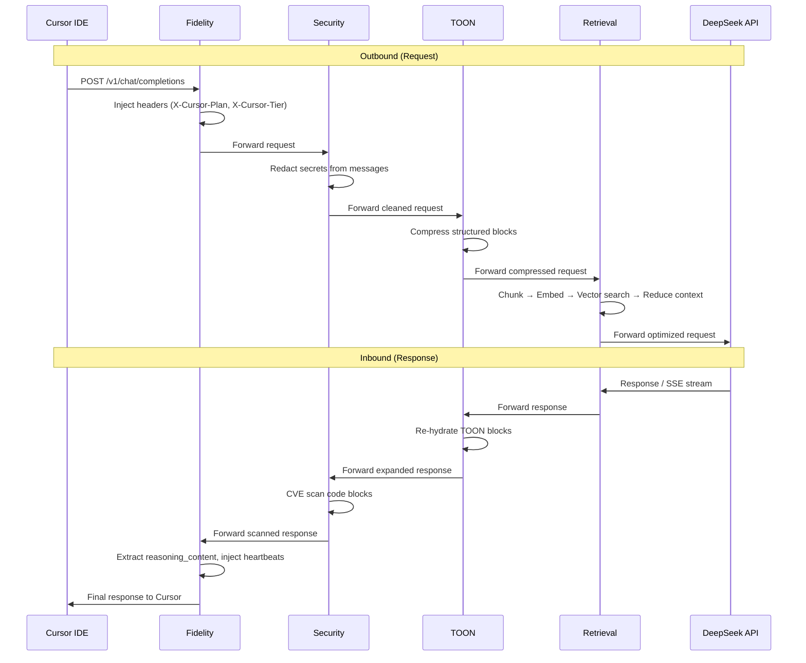

# DeepSeek Cursor Proxy + Smart RAP

A local proxy between Cursor IDE and the DeepSeek API that adds reasoning token caching, context recovery, and the Smart RAP (Retrieval-Augmented Proxy) middleware pipeline.

---

## Table of Contents

- [Project Overview](#project-overview)
- [Architecture](#architecture)
- [Features](#features)
  - [Original Proxy Features](#original-proxy-features)
  - [RAP Features](#rap-features-smart-retrieval-augmented-proxy)
- [Quick Start](#quick-start)
  - [Prerequisites](#prerequisites)
  - [Installation](#installation)
  - [Start Everything](#start-everything)
  - [Connect Cursor](#connect-cursor)
  - [Script Commands](#script-commands)
- [Configuration](#configuration)
  - [Original Proxy Config](#original-proxy-config)
  - [RAP Config](#rap-config)
  - [Validation Rules](#validation-rules)
- [API Reference](#api-reference)
- [Project Structure](#project-structure)
- [Development Guide](#development-guide)
  - [Running Tests](#running-tests)
  - [Property-Based Testing](#property-based-testing)
  - [Adding a New RAP Module](#adding-a-new-rap-module)
- [Infrastructure](#infrastructure)
  - [Qdrant](#qdrant)
  - [LM Studio](#lm-studio)
  - [Ngrok](#ngrok)
- [Feature Progress / Changelog](#feature-progress--changelog)
- [Troubleshooting](#troubleshooting)
- [Known Limitations](#known-limitations)
- [Security](#security)

---

## Project Overview

DeepSeek Cursor Proxy sits between Cursor IDE and the DeepSeek API, solving two problems:

1. **Reasoning token loss** — Cursor discards DeepSeek's `reasoning_content` tokens between turns. The proxy caches them in SQLite and re-injects them into subsequent requests, preserving chain-of-thought continuity.

2. **Context optimization** — The Smart RAP pipeline compresses, retrieves, and secures context before it reaches the API, reducing token usage while maintaining quality.

### Key Value Propositions

| Capability | Benefit |
|-----------|---------|
| Reasoning cache | No more lost thinking tokens between Cursor turns |
| Context compression (TOON) | 30%+ reduction in structured data tokens |
| Vector retrieval (Qdrant) | Only relevant context sent to API |
| Secret redaction | API keys and credentials never leave your machine |
| CVE scanning | Local vulnerability detection on generated code |
| Graceful degradation | Proxy works even when optional services are down |
| Zero external dependencies | All processing is local (LM Studio, Qdrant on localhost) |

---

## Architecture

### Original Proxy

The base proxy uses Python's stdlib `http.server` with `ThreadingHTTPServer`:

- Receives OpenAI-format requests from Cursor
- Rewrites model names to DeepSeek equivalents
- Injects cached `reasoning_content` into conversation history
- Forwards to DeepSeek API, caches new reasoning tokens on response
- Exposes an ngrok tunnel for Cursor's "Override OpenAI Base URL" setting

### RAP Extension

Five middleware modules layered on top of the original proxy:

| Module | Role |
|--------|------|
| **Fidelity** | Header spoofing, reasoning pass-through, heartbeat keep-alive |
| **Security Gateway** | Outbound secret redaction, inbound CVE scanning, audit logging |
| **TOON Engine** | Structured data compression and re-hydration |
| **Retrieval Layer** | Context chunking, embedding, vector search |
| **Pipeline Orchestrator** | Phase ordering, graceful degradation, health checks |

### Request/Response Flow



**Text diagram (non-Mermaid):**

```
Outbound:
  Cursor → [Fidelity] → [Security] → [TOON] → [Retrieval] → DeepSeek API

Inbound:
  DeepSeek API → [Retrieval] → [TOON] → [Security] → [Fidelity] → Cursor
```

---

## Features

### Original Proxy Features

**Reasoning Token Caching and Recovery**
- Caches `reasoning_content` from DeepSeek responses in SQLite
- Re-injects cached reasoning into subsequent requests
- Configurable strategy: `recover` (inject placeholder) or `reject` (return 409)

**Model Name Rewriting**
- Maps Cursor's model names to DeepSeek equivalents
- Fallback model configurable via `model` in config

**Thinking Mode Support**
- `thinking: enabled` or `thinking: disabled`
- Configurable `reasoning_effort` (max, medium, low)
- Display reasoning in collapsible blocks

**Missing Reasoning Strategy**
- `recover` — injects a recovery notice and continues
- `reject` — returns HTTP 409 with explanation

**Ngrok Tunnel**
- Auto-starts ngrok when `ngrok: true` in config
- Saves URL to `~/.deepseek-cursor-proxy/.ngrok_url`
- Provides HTTPS endpoint for Cursor's "Override OpenAI Base URL"

**Request Deduplication**
- SHA-256 hash of canonical request payload
- Concurrent identical non-streaming requests share a single upstream call
- Reduces redundant API usage from Cursor's retry behavior

**Metrics Endpoint**
- `GET /metrics` returns JSON with request counts, latency, cache hit rate
- Tracks: total, active, completed, failed, rejected, cache_hit, cache_miss

**Trace Logging**
- Optional detailed request/response tracing to disk
- Records full payloads, headers, timing, and outcomes

---

### RAP Features (Smart Retrieval-Augmented Proxy)

#### Fidelity Module

| Feature | Description |
|---------|-------------|
| Header spoofing | Injects `X-Cursor-Plan: pro` and `X-Cursor-Tier: unlimited` |
| Reasoning pass-through | Extracts `reasoning_content` from SSE chunks as distinct stream |
| Heartbeat keep-alive | Injects `: heartbeat\n\n` SSE comments during long reasoning cycles |
| Stream timeout | Closes stream after 60s of no data |
| Idempotent | Applying headers twice produces same result as once |

#### Security Gateway

| Feature | Description |
|---------|-------------|
| Outbound secret redaction | Regex patterns (API keys, AWS keys, SSH keys, JWTs, GitHub tokens) + Shannon entropy detection (≥4.5, 16+ chars) |
| Inbound CVE scanning | Extracts code blocks from responses, analyzes via local LLM |
| Audit logging | SQLite at `~/.deepseek-cursor-proxy/audit.sqlite3`, 0o600 permissions |
| Immutable processing | `scan_outbound()` returns deep copy — original payload never mutated |
| Graceful failure | DB corruption or full disk → logging skipped, processing continues |

#### TOON Engine

| Feature | Description |
|---------|-------------|
| Block detection | Identifies file trees, symbol maps, multi-file diffs |
| Compression | Converts to pipe-delimited TOON format (30%+ compression ratio) |
| Re-hydration | Converts TOON format back to original JSON structure |
| Minimum block size | Only processes blocks ≥ 64 bytes (configurable) |
| Role preservation | Message count and roles unchanged after compression |

#### Retrieval Layer

| Feature | Description |
|---------|-------------|
| Context chunking | 512-token windows with 64-token overlap (tiktoken) |
| Embedding | Via LM Studio `/v1/embeddings` endpoint |
| Vector storage | Qdrant with MessagePack transport (~40% smaller than JSON) |
| Context reduction | Top-k chunks with score > 0.5, assembled within token budget |
| Message preservation | System messages and latest user message always preserved |
| Retry logic | Exponential backoff (1s→2s→4s... cap 60s/delay, 5 min total) |
| Health check | Verifies LM Studio model loaded + Qdrant reachable |

#### Pipeline Orchestrator

| Feature | Description |
|---------|-------------|
| Phase ordering | Fidelity → Security → TOON → Retrieval (outbound) |
| Phase toggles | Each module independently enabled/disabled |
| Graceful degradation | Failing phase is logged and skipped |
| Health endpoint | Aggregates health from all enabled modules |

---

## Quick Start

### Prerequisites

| Requirement | Purpose |
|-------------|---------|
| Python 3.11+ | Runtime |
| Podman | Qdrant container |
| LM Studio | Local embeddings and CVE scanning |
| ngrok | HTTPS tunnel for Cursor |
| Embedding model | `text-embedding-nomic-embed-text-v1.5-embedding` in LM Studio |

### Installation

```bash
git clone https://github.com/user/deepseek-cursor-proxy.git
cd deepseek-cursor-proxy
pip install -e ".[dev]"
```

### Start Everything

```bash
./scripts/start-rap.sh
```

This starts:
1. Qdrant vector database (Podman container with persistent volume)
2. LM Studio server + loads the embedding model
3. The proxy with RAP pipeline + ngrok tunnel

### Connect Cursor

1. Copy the ngrok URL printed by the startup script
2. In Cursor: **Settings → Models → Override OpenAI Base URL**
3. Paste: `https://<your-ngrok-url>/v1`
4. Enter your DeepSeek API key in the API key field

### Script Commands

```bash
./scripts/start-rap.sh              # Start all services
./scripts/start-rap.sh --ngrok URL  # Use a specific ngrok URL
./scripts/start-rap.sh --stop       # Stop everything
./scripts/start-rap.sh --status     # Check status of all services
```

---

## Configuration

Config file location: `~/.deepseek-cursor-proxy/config.yaml`

Auto-created on first run with sensible defaults.

### Original Proxy Config

| Field | Default | Description |
|-------|---------|-------------|
| `base_url` | `https://api.deepseek.com` | DeepSeek API base URL |
| `model` | `deepseek-v4-flash` | Fallback model name |
| `thinking` | `enabled` | Enable/disable thinking mode (`enabled`/`disabled`) |
| `reasoning_effort` | `max` | Reasoning effort level |
| `display_reasoning` | `true` | Show reasoning in responses |
| `collapsible_reasoning` | `true` | Wrap reasoning in collapsible blocks |
| `host` | `127.0.0.1` | Proxy listen address |
| `port` | `9000` | Proxy listen port |
| `ngrok` | `true` | Auto-start ngrok tunnel |
| `verbose` | `false` | Verbose logging |
| `request_timeout` | `900` | Upstream request timeout (seconds) |
| `max_request_body_bytes` | `52428800` | Max request body size (50 MB) |
| `cors` | `false` | Enable CORS headers |
| `missing_reasoning_strategy` | `recover` | `recover` or `reject` |
| `reasoning_cache_max_age_seconds` | `2592000` | Cache TTL (30 days) |
| `reasoning_cache_max_rows` | `100000` | Max cached reasoning entries |

### RAP Config

| Field | Default | Description |
|-------|---------|-------------|
| `phase_bridge` | `true` | Enable Fidelity module |
| `phase_compression` | `false` | Enable TOON compression |
| `phase_retrieval` | `false` | Enable Retrieval layer |
| `phase_security` | `false` | Enable Security gateway |
| `heartbeat_interval` | `15` | Heartbeat interval (seconds) |
| `qdrant_url` | `http://localhost:6333` | Qdrant REST endpoint |
| `qdrant_collection` | `rap_context` | Qdrant collection name |
| `embedding_url` | `http://localhost:1234/v1/embeddings` | LM Studio embeddings endpoint |
| `embedding_model` | `text-embedding-nomic-embed-text-v1.5-embedding` | Embedding model identifier |
| `retrieval_top_k` | `5` | Number of chunks to retrieve |
| `retrieval_max_tokens` | `1000` | Max tokens in reduced context |
| `redaction_enabled` | `true` | Enable outbound secret redaction |
| `cve_scanning_enabled` | `true` | Enable inbound CVE scanning |
| `entropy_threshold` | `4.5` | Shannon entropy threshold for secret detection |
| `security_model_url` | `http://localhost:1234/v1/chat/completions` | LLM endpoint for CVE scanning |
| `toon_min_block_size` | `64` | Minimum block size for TOON (bytes) |
| `toon_compression_enabled` | `true` | Enable TOON compression |
| `toon_rehydration_enabled` | `true` | Enable TOON re-hydration |

### Validation Rules

| Field | Constraint |
|-------|-----------|
| `heartbeat_interval` | (0, 60] seconds |
| `retrieval_top_k` | [1, 50] |
| `retrieval_max_tokens` | [100, 10000] |
| `entropy_threshold` | [3.0, 8.0] |
| `toon_min_block_size` | ≥ 64 bytes |
| `qdrant_url` | Valid HTTP URL |
| `embedding_url` | Valid HTTP URL |

### Enabling/Disabling RAP Modules

Each module is controlled by its phase toggle. Set in `config.yaml`:

```yaml
# Enable all RAP modules
phase_bridge: true
phase_compression: true
phase_retrieval: true
phase_security: true
```

```yaml
# Minimal mode (just header injection)
phase_bridge: true
phase_compression: false
phase_retrieval: false
phase_security: false
```

---

## API Reference

### POST /v1/chat/completions

Main proxy endpoint. Accepts OpenAI-format chat completion requests.

```bash
curl -X POST http://127.0.0.1:9000/v1/chat/completions \
  -H "Content-Type: application/json" \
  -H "Authorization: Bearer YOUR_DEEPSEEK_KEY" \
  -d '{
    "model": "deepseek-chat",
    "messages": [{"role": "user", "content": "Hello"}],
    "stream": true
  }'
```

- Supports both streaming (SSE) and non-streaming responses
- Authorization header forwarded to DeepSeek
- Request passes through enabled RAP pipeline phases

### GET /healthz

Returns health status of the proxy and all pipeline components.

```bash
curl http://127.0.0.1:9000/healthz
```

Response:
```json
{
  "pipeline": "healthy",
  "phases": {
    "fidelity": "healthy",
    "security": "disabled",
    "toon": "disabled",
    "retrieval": "healthy"
  },
  "config": {
    "phase_bridge": true,
    "phase_compression": false,
    "phase_retrieval": true,
    "phase_security": false
  }
}
```

Retrieval health states: `healthy`, `model_not_loaded`, `degraded`, `unhealthy`.

### GET /metrics

Returns request metrics as JSON.

```bash
curl http://127.0.0.1:9000/metrics
```

Response:
```json
{
  "total": 142,
  "active": 1,
  "completed": 138,
  "failed": 2,
  "rejected": 1,
  "cache_hit": 45,
  "cache_miss": 93,
  "avg_latency_ms": 2340.5,
  "max_latency_ms": 12500.0
}
```

### GET /v1/models

Returns available model list.

```bash
curl http://127.0.0.1:9000/v1/models
```

Response:
```json
{
  "object": "list",
  "data": [
    {"id": "deepseek-v4-flash", "object": "model", "created": 1700000000, "owned_by": "deepseek"},
    {"id": "deepseek-v4-pro", "object": "model", "created": 1700000000, "owned_by": "deepseek"}
  ]
}
```

---

## Project Structure

```
src/deepseek_cursor_proxy/
├── __init__.py                 # Package init
├── __main__.py                 # Entry point (python -m deepseek_cursor_proxy)
├── cli.py                      # CLI argument parsing
├── config.py                   # ProxyConfig dataclass, YAML loading
├── log_format.py               # Log formatting utilities
├── logging.py                  # Logger setup, TerminalSpinner
├── reasoning_store.py          # SQLite reasoning token cache
├── server.py                   # ThreadingHTTPServer, request handling, dedup
├── streaming.py                # SSE stream processing, reasoning display
├── trace.py                    # Request/response trace writer
├── transform.py                # Model rewriting, reasoning injection
├── tunnel.py                   # Ngrok tunnel management
└── rap/
    ├── __init__.py             # RAP package init
    ├── app.py                  # FastAPI application (endpoints, lifespan)
    ├── config.py               # RAPConfig dataclass with validation
    ├── fidelity.py             # Header spoofing, reasoning pass-through, heartbeat
    ├── pipeline.py             # Pipeline Orchestrator (wires all modules)
    ├── retrieval.py            # Context chunking, embedding, Qdrant vector search
    ├── security.py             # Secret redaction, CVE scanning, audit logging
    └── toon.py                 # TOON compression/re-hydration engine

scripts/
└── start-rap.sh                # Start/stop all infrastructure

tests/
├── test_rap_app.py                                    # FastAPI endpoint tests
├── test_rap_config.py                                 # Config validation tests
├── test_rap_config_properties.py                      # Config property tests (Hypothesis)
├── test_rap_integration.py                            # End-to-end integration tests
├── test_rap_pipeline.py                               # Pipeline orchestration tests
├── test_rap_pipeline_properties.py                    # Pipeline property tests
├── test_fidelity.py                                   # Fidelity module unit tests
├── test_fidelity_properties.py                        # Fidelity property tests
├── test_fidelity_stream.py                            # Stream health tests
├── test_fidelity_stream_properties.py                 # Stream property tests
├── test_retrieval.py                                  # Retrieval chunking tests
├── test_retrieval_properties.py                       # Chunking property tests
├── test_retrieval_embed.py                            # Embedding tests
├── test_retrieval_embed_properties.py                 # Embedding property tests
├── test_retrieval_qdrant.py                           # Qdrant storage tests
├── test_retrieval_qdrant_properties.py                # Qdrant property tests
├── test_retrieval_build_context.py                    # build_reduced_context tests
├── test_retrieval_message_preservation_properties.py  # Message preservation PBT
├── test_security.py                                   # Redaction unit tests
├── test_security_properties.py                        # Redaction property tests
├── test_security_cve.py                               # CVE scanning tests
├── test_security_cve_properties.py                    # CVE property tests
├── test_security_audit.py                             # Audit logging tests
├── test_security_audit_properties.py                  # Audit property tests
├── test_toon.py                                       # TOON compression tests
└── test_toon_properties.py                            # TOON property tests
```

---

## Development Guide

### Running Tests

```bash
# All tests (520 tests, ~96 seconds)
python -m pytest tests/ -q

# Property-based tests only
python -m pytest tests/ -k "properties" -q

# RAP module tests only (fast, ~10s)
python -m pytest tests/test_rap_*.py tests/test_fidelity*.py \
  tests/test_retrieval*.py tests/test_security*.py tests/test_toon*.py -q

# Single module
python -m pytest tests/test_security.py -q
```

All external services (LM Studio, Qdrant, DeepSeek API) are mocked in tests — no real network calls.

### Property-Based Testing

The project uses the [Hypothesis](https://hypothesis.readthedocs.io/) library for property-based testing.

**23 correctness properties** covering all modules:

| Module | Properties Tested |
|--------|-------------------|
| Config | Validation constraints hold for all valid inputs |
| Pipeline | Phase ordering, graceful degradation |
| Fidelity | Header idempotency, stream integrity |
| TOON | Non-overlapping detection, compression ratio, round-trip, role preservation |
| Retrieval | Token budget compliance, score threshold, MessagePack efficiency, message preservation |
| Security | Redaction completeness/immutability, CVE finding structure, audit entry completeness |

**Reduced examples for CI speed:**
- Default max examples: 30 (was 200)
- Medium: 20 (was 100)
- Light: 10 (was 50)

### Adding a New RAP Module

1. **Create module** in `src/deepseek_cursor_proxy/rap/`:
   ```python
   # src/deepseek_cursor_proxy/rap/my_module.py
   class MyModule:
       def __init__(self, config: RAPConfig):
           self.config = config

       def process_outbound(self, payload: dict) -> dict:
           # Transform outbound request
           return payload

       def process_inbound(self, response: dict) -> dict:
           # Transform inbound response
           return response

       def health_check(self) -> str:
           return "healthy"
   ```

2. **Add phase toggle** to `RAPConfig` in `config.py`:
   ```python
   phase_my_module: bool = False
   ```

3. **Wire into PipelineOrchestrator** in `pipeline.py`:
   ```python
   if self.config.phase_my_module:
       self.my_module = MyModule(config)
   ```

4. **Add `health_check()` method** — return one of: `healthy`, `degraded`, `unhealthy`, `disabled`

5. **Write property tests** in `tests/test_my_module_properties.py`:
   ```python
   from hypothesis import given, settings, strategies as st

   @settings(max_examples=30)
   @given(payload=st.dictionaries(st.text(), st.text()))
   def test_my_module_preserves_keys(payload):
       result = my_module.process_outbound(payload)
       assert set(result.keys()) >= set(payload.keys())
   ```

---

## Infrastructure

### Qdrant

| Property | Value |
|----------|-------|
| Container name | `rap-qdrant` |
| Image | `docker.io/qdrant/qdrant:latest` |
| Persistent volume | `rap_qdrant_storage` |
| REST port | 6333 |
| gRPC port | 6334 |
| Dashboard | http://localhost:6333/dashboard |
| Transport | MessagePack (binary, ~40% smaller than JSON) |
| Network | Localhost only (127.0.0.1) |

**Manual management:**
```bash
# Start
podman run -d --name rap-qdrant \
  -p 6333:6333 -p 6334:6334 \
  -v rap_qdrant_storage:/qdrant/storage:z \
  docker.io/qdrant/qdrant:latest

# Stop
podman stop rap-qdrant

# Logs
podman logs rap-qdrant

# Remove (keeps volume)
podman rm rap-qdrant
```

### LM Studio

| Property | Value |
|----------|-------|
| Server port | 1234 |
| Embedding model | `text-embedding-nomic-embed-text-v1.5-embedding` |
| Status API | `GET /api/v1/models` (shows `loaded_instances`) |
| Embeddings API | `POST /v1/embeddings` |
| Chat API | `POST /v1/chat/completions` (for CVE scanning) |

**CLI commands:**
```bash
lms server start --port 1234       # Start server
lms load <model> --gpu max         # Load model to GPU
lms ps                             # List loaded models
lms unload --all                   # Unload all models
```

**Notes:**
- Models stored on external M.2 — loading takes time (30–120s)
- Disable "Require Authentication" in LM Studio settings
- Disable JIT model loading in Developer tab to prevent Gemma4 auto-loading

### Ngrok

| Property | Value |
|----------|-------|
| Auto-start | When `ngrok: true` in config |
| URL file | `~/.deepseek-cursor-proxy/.ngrok_url` |
| Dashboard | http://127.0.0.1:4040 |
| Protocol | HTTPS |

- Auto-started by the proxy when `ngrok: true` in config
- URL saved to `~/.deepseek-cursor-proxy/.ngrok_url` for reuse
- Can provide an external URL via `--ngrok URL` flag to the start script
- Free tier: URLs change on restart

---

## Feature Progress / Changelog

| Phase | Scope | Status |
|-------|-------|--------|
| Phase 1 | Foundation + Bridge & Fidelity | ✅ Complete |
| Phase 2 | TOON Compression | ✅ Complete |
| Phase 3 | Retrieval Layer (Qdrant + LM Studio) | ✅ Complete |
| Phase 4 | Security Gateway | ✅ Complete |
| Phase 5 | Integration + FastAPI app | ✅ Complete |

**Post-spec enhancements:**
- ✅ Fixed retry loop memory overflow bug (delay calculation going to 0.0s)
- ✅ Fixed retry logic to not retry 400/4xx client errors (non-retryable)
- ✅ Fixed Qdrant communication: uses JSON REST API (not MessagePack over HTTP)
- ✅ Added LM Studio health check via `/api/v1/models` (reports model loaded status)
- ✅ Updated default embedding model to `text-embedding-nomic-embed-text-v1.5-embedding`
- ✅ Added explicit `security_model_name` config (default: `ibm-grok4-ultrafast-coder-1b`)
- ✅ Startup script pre-loads both embedding + security models at boot
- ✅ Created `scripts/start-rap.sh` startup script (Podman + LM Studio + proxy + ngrok)
- ✅ Reduced property test examples for faster CI (200→30, 100→20, 50→10)
- ✅ Original proxy integration (RAP pipeline wired into `server.py`)
- ✅ RAP action logging (`├ rap headers redacted compressed(X%) retrieved(X→Ymsgs)`)
- ✅ HITL interception (AskQuestion tool_calls converted to content messages)
- ✅ All 4 phases enabled by default (bridge, compression, retrieval, security)

**All 46 implementation tasks completed. 520 tests passing.**

**Operational notes:**
- TOON compression activates when messages contain structured blocks (file trees, symbol maps, diffs). In Cursor's planning/agent mode with tool_calls, structured blocks are rare — TOON will activate more in manual code-paste workflows.
- Retrieval/Qdrant activates when there are "middle context" messages with text content to chunk. In agent mode, most context is tool_call/tool_result pairs which are preserved unchanged to maintain agent state.

---

## Troubleshooting

### `model_not_loaded` in health check

The embedding model isn't loaded in LM Studio:

```bash
lms load text-embedding-nomic-embed-text-v1.5-embedding --gpu max
```

Wait 30–120s for loading from external storage.

### Memory overflow from retry loop

**Fixed.** The retry logic previously had a bug where delay could calculate to 0.0s, causing a tight infinite loop. Now capped at 60s per delay, 5 minutes total. Additionally, 4xx errors (400, 401, 404, 422) are never retried since they indicate client errors that won't succeed on retry.

### Qdrant 400 Bad Request on upsert

**Fixed.** Qdrant's REST API only accepts JSON, not MessagePack. The proxy now sends JSON to Qdrant's HTTP endpoints. MessagePack efficiency is still validated in property tests as a format comparison.

### Qdrant not starting

```bash
podman logs rap-qdrant
```

Common causes:
- Port 6333 already in use
- Volume permissions issue
- Podman not running

### LM Studio "auth required" errors

Disable authentication in LM Studio:
- Settings → Server → Uncheck "Require Authentication"

### Gemma4 auto-loading on requests

LM Studio's JIT loading feature loads Gemma4 instead of the embedding model:
- Developer tab → Disable "Just-In-Time Model Loading"

### Test failures in `test_transform.py`

Pre-existing flaky test in the original proxy (test ordering issue). Not related to RAP.

### Proxy not responding after start

```bash
./scripts/start-rap.sh --status
```

Check each service individually:
```bash
curl http://localhost:6333/collections     # Qdrant
curl http://localhost:1234/v1/models        # LM Studio
curl http://127.0.0.1:9000/healthz         # Proxy
```

---

## Known Limitations

- **TOON scope** — Only handles file trees, symbol maps, and multi-file diffs. Other structured formats pass through unchanged.
- **CVE scanning quality** — Depends on local LLM quality. Results are advisory, not authoritative.
- **Streaming bypass** — Streaming responses bypass the inbound pipeline (TOON re-hydration and CVE scanning only apply to non-streaming).
- **Qdrant collection** — Not auto-created. Must exist before first use.
- **No WebSocket support** — HTTP only.
- **Ngrok free tier** — URLs change on restart. Use `--ngrok URL` with a fixed domain if available.

---

## Security

### Design Principles

| Principle | Implementation |
|-----------|---------------|
| Localhost only | All local services bound to 127.0.0.1 |
| Redact before send | Secrets removed before any data leaves the machine |
| No external calls from middleware | LM Studio and Qdrant are local — no data sent to third parties |
| Minimal audit storage | Audit DB stores metadata only (timestamps, hashes, counts) — never secrets |
| File permissions | Audit DB and config: 0o600 (owner read/write only) |
| Immutable processing | Redaction returns deep copies — original payloads never mutated |

### Secret Detection Patterns

- AWS access keys (`AKIA...`)
- Generic API keys (`sk-`, `api_key=`, etc.)
- SSH private keys (`-----BEGIN`)
- JWT tokens (`eyJ...`)
- GitHub tokens (`ghp_`, `gho_`, `ghs_`)
- Environment variable assignments with high-entropy values
- Shannon entropy detection (≥4.5 threshold, 16+ character strings)

### Audit Trail

```
~/.deepseek-cursor-proxy/audit.sqlite3
```

Records per request:
- Timestamp
- Direction (inbound/outbound)
- Request hash (SHA-256 of payload)
- Redaction count
- CVE finding count
- Processing status

No secrets, API keys, or message content stored in the audit database.
